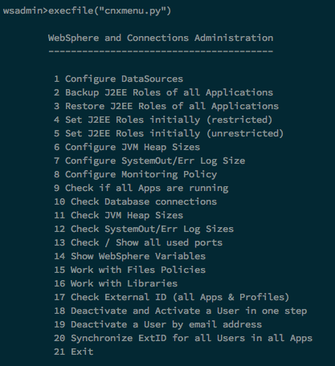
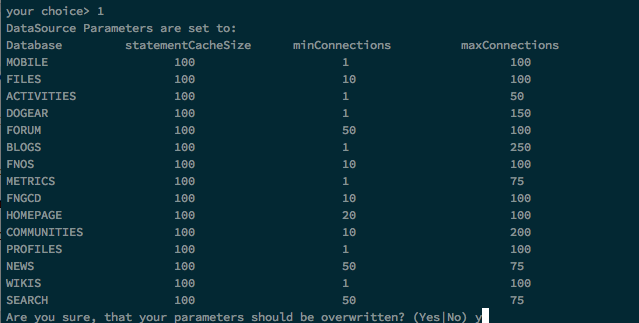
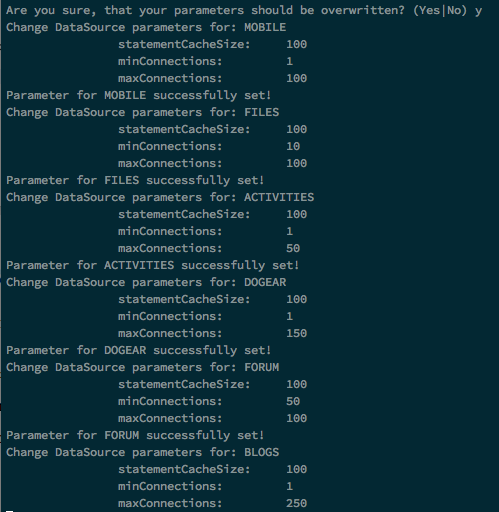
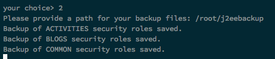
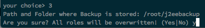
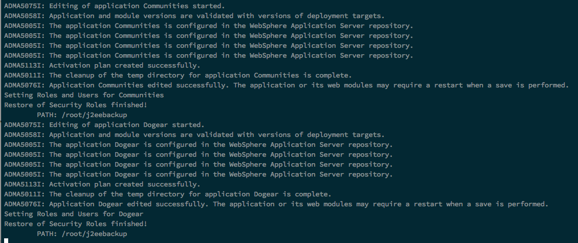
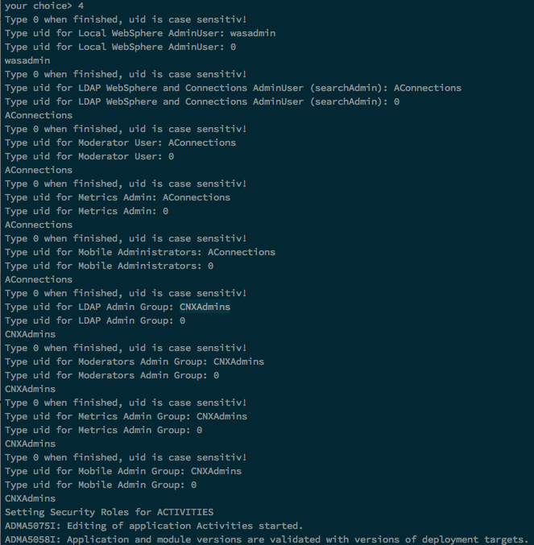

# Install jython scripts

I copy all *.py scripts to $WAS_HOME/profiles/Dmgr01/bin or create symbolic links there. This is the easiest way to get maximum functionality.

	cp *.py $WAS_HOME/profiles/Dmgr01/bin
	
Alternative: copy Scripts to a local folder and create Symbolic Links:

	ln -s /opt/IBM/scripts/*.py $WAS_HOME/profiles/Dmgr01/bin

# loadAll.py

This script calls all IBM Connections functions.

# Call Scripts

## Using the menu

### Linux
Change to `WASROOT/profiles/Dmgr01/bin`

    ./wsadmin.sh -lang jython -profile cnxmenu.py

### Windows
Change to `WASROOT\profiles\Dmgr01\bin`

    wsadmin.bat -lang jython -profile cnxmenu.py

## when loading wsadmin

You have to call the scripts with `-username adminuser -password yourpassword` or you get a password popup.

### Linux
Change to `WASROOT/profiles/Dmgr01/bin`

    ./wsadmin.sh -lang jython -f scriptname.py

### Windows
Change to `WASROOT\profiles\Dmgr01\bin`

    wsadmin.bat -lang jython -f scriptname.py

## alternative through wsadmin profile

### Linux
Change to `WASROOT/profiles/Dmgr01/bin`

    ./wsadmin.sh -lang jython -profile scriptname.py

### Windows
Change to `WASROOT\profiles\Dmgr01\bin`

    wsadmin.bat -lang jython -profile scriptname.py

## within wsadmin

	execfile("scriptname.py")
	
# Script descriptions

## 1 - Configure Data Sources (cfgDataSource.py)

Script shows you the actual parameters for minConnections and maxConnections

Accept to change these settings (y, yes or j):

## 2 - Backup J2EE Roles of all Applications (cfgJ2EERoleBackup.py)

Creates a backup of all installed applications of WebSphere Cell.

Script asks for a Backup path to save text files with roles. Folder will be created, when it does not exists.

## 3 - Restore J2EE Roles of all Applications (cfgJ2EERoleRestore.py)

Restore the backup cfgJ2EERoleBackup.py has created. You must provide the backup path!

You will be asked, if you're sure. Please consider, that after saving the configuration all applications will restart automatically and can't be accessed for some minutes.

## 4 - Set J2EE Roles initially (restricted) (cfgJ2EERolesRestricted.py)

To set J2EE Roles initially, you can use this script. Script will ask you for local Admin, LDAP Admin, Moderator, Mobile Admin, Metrics Admin, LDAP Admin Group, Moderator Group, Mobile Admin Group and Metrics Admin Group. 

Type the Admin Users or Groups, when you have multiple Users or Groups for a Role, type them in the next line. Finish one Role with "0".

Role settings restricted means, that all Users must authenticate to read anything.

## 5 - Set J2EE Roles initially (unrestricted) (cfgJ2EERolesUnrestricted.py)

To set J2EE Roles initially, you can use this script. Script will ask you for local Admin, LDAP Admin, Moderator, Mobile Admin, Metrics Admin, LDAP Admin Group, Moderator Group, Mobile Admin Group and Metrics Admin Group. 

Type the Admin Users or Groups, when you have multiple Users or Groups for a Role, type them in the next line. Finish one Role with "0".

Public content can be read from Blogs, Profiles and Wikis.

## 6 - Configure JVM Heap Sizes (cfgJVMHeap.py)

## 7 - Configure SystemOut/Err Log Size (cfgLogFiles.py)

## 8 - Configure Monitoring Policy (cfgMonitoringPolicy.py)

## 9 - Check if all Apps are running (checkAppStatus.py)

## 10 - Check Database connections (checkDataSource.py)

## 11 - Check JVM Heap Sizes (checkJVMHeap.py)

## 12 - Check SystemOut/Err Log Sizes (checkLogFiles.py)

## 13 - Check / Show all used ports (checkPorts.py)

## 14 - Show WebSphere Variables (checkVariables.py)

## 15 - Work with Files Policies (cnxFilesPolicies.py)

## 16 - Work with Libraries (cnxLibraryPolicies.py)

## 17 - Check External ID (all Apps & Profiles) (cnxMemberCheckExIDByEmail.py)

## 18 - Deactivate and Activate a User in one step (cnxMemberDeactAndActByEmail.py)

## 19 - Deactivate a User by email address (cnxMemberInactivateByEmail.py)

## 20 - Synchronize ExtID for all Users in all Apps (cnxMemberSyncAllByEXID.py)
